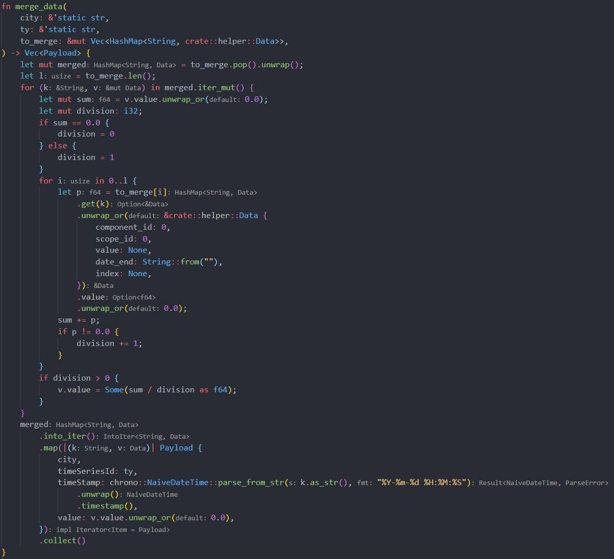
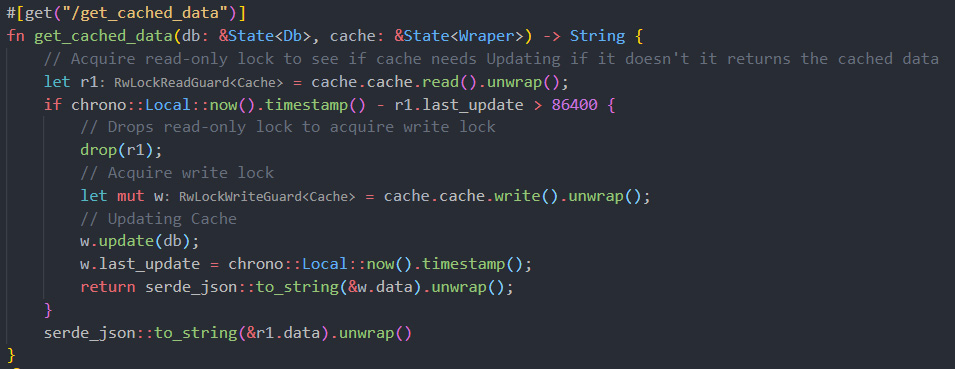
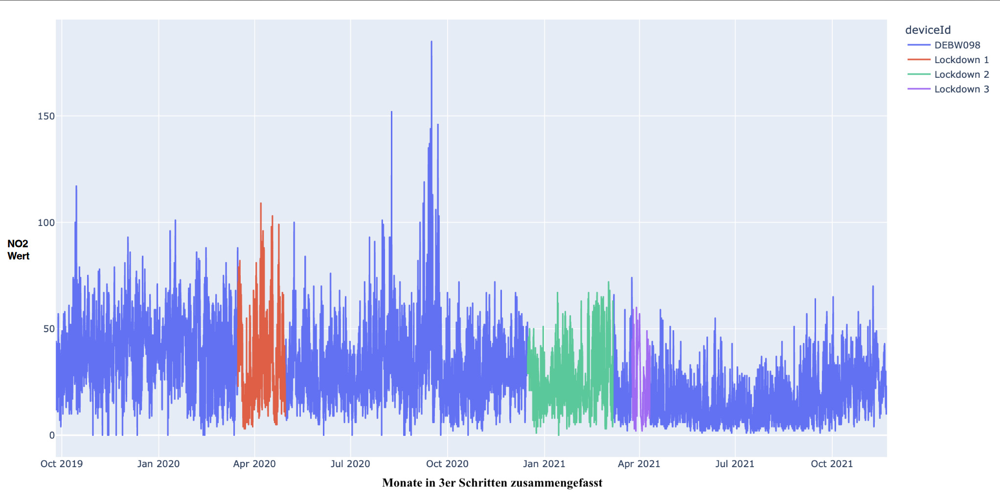
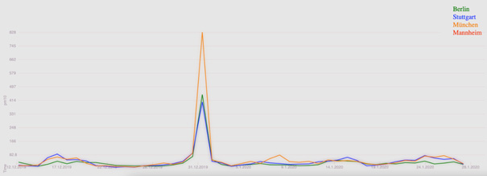
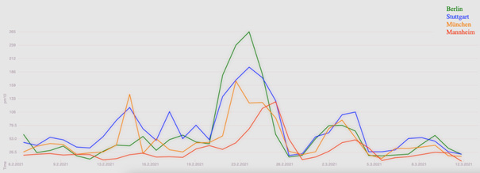

 
# Luftqualität durch Corona
 
## Einführung
 
### Abstract
Nichts hat die globale und unsere alltägliche Welt zurzeit so im Griff wie die sogenannte „Corona-Krise“ und der Umgang mit dem neuartigen Virus SARS-CoV-2. Damit sich die hochansteckende Lungenkrankheit Covid-19, die aus dem Virus resultiert, nicht weiterhin ausbreitet und das deutsche Gesundheitssystem überlastet, sind im März 2020 verschiedene Maßnahmen von der deutschen Bundesregierung erlassen worden. Beispielsweise eine Ausgangssperre in Bayern und anderen Bundesländern, die bundesweite Schließung von Schulen und Kitas, Geschäften, Cafés, Bars, Restaurants, Theatern und Kulturzentren oder ein generelles soziales (körperliches) Kontaktverbot.
In diesem Semester (WS21) war es unsere Aufgabe im Rahmen der GDV-Veranstaltung in Gruppen ein aktuelles Thema unter die Lupe zu nehmen. Das Thema soll mit den Daten der MVV untersucht werden können, die im Rahmen des Smart Roots Projekts gesammelt werden. Es soll mit denen in der Vorlesung gelernten Visualisierungsarten umgesetzt werden und auch für außenstehende Betrachter intuitiv und verständlich sein.
Das von unserer Gruppe gewählte Thema war die Untersuchung der Luftqualität ausgewählter Städte im Corona Zeitraum und den Zusammenhang zu  den dazugehörigen Maßnahmen.
Wir haben im Rahmen des Projekts die Städte Mannheim, Stuttgart, München und Berlin untersucht.
 
### Einleitung
Die Auswirkungen der aufgesetzten Corona-Maßnahmen machen sich in vielen Bereichen unseres alltäglichen Lebens bemerkbar und wir wollten untersuchen, ob sich dies auch in Daten widerspiegelt. Aufgrund dessen das Corona auf alle Elemente des Lebens Einfluss hat, stießen wir in der Findungsphase unseres Projekts auf diverse Hypothesen, die potenziell eine interessante Basis zur visuellen Untersuchung boten. Durch die vorgegebenen Daten der MVV kamen wir auf die Idee, die Luftqualität im Zeitraum der Pandemie zu betrachten. 
Unsere erste Hürde lag darin, eine Hypothese aufzustellen, die diesem Thema gerecht wird. Eine Überlegung war es, ob die mögliche Verbesserung der Luftqualität, durch die Corona-Maßnahmen, einen positiven Einfluss auf die Gesundheit der Menschen hat. Diese Hypothese wurde allerdings verworfen, da die Gesundheit ein zu komplexes, zu viele Einflussfaktoren, und träges, Auswirkungen zeigen sich erst spät, Attribut ist. Dennoch haben wir untersucht, wie die Corona-Maßnahmen im allgemeinen Auswirkungen auf die Luftqualität haben. Unsere Auswertungen liefern z.B. für Stickstoffdioxid eine klare Verringerung über 3 Jahre hinweg, ein klarer Zusammenhang mit spezifischen Maßnahmen gibt es nicht. Einen drastischen   der Maßnahmen auf die Feinstaubbelastung erkennt man an Silvester, aufgrund des Böllerverbots. Hier war der Feinstaub in Berlin, wo es kein absolutes Feuerwerksverbot (offizielles Feuerwerk) gab, um ein vielfaches höher als in den anderen Städten. Eine interessante Erkenntnis, welche uns vorher nicht bewusst war, aber durch die Visualisierung aufgefallen ist, ist der Einfluss auf die Feinstaubbelastung durch die Saharawinde in Deutschland von Februar 2021. Hier gibt es ortsunabhängig in Deutschland einen klaren Anstieg der Feinstaubwerte über mehrere Tage hinweg.
 
### Fragen & Hypothesen
 
Haben die Corona-Maßnahmen positiven Einfluss auf die Gesundheit in Bezug zur Luftqualität?
- Aufgrund der Komplexität der Gesundheit konnten wir diese Frage nicht beantworten
 
Die Luftqualität hat sich Pandemie bedingt aufgrund der Corona-Maßnahmen in den untersuchten Städten gebessert?
 
-  Unsere Auswertungen lieferten in einigen Schadstoff Bereichen eine konstante Besserungen der Luftqualität über 3 Jahre hinweg. Die stärkste mögliche Auswirkung der Maßnahmen gab es an Silvester. 
 
Hat sich die Luftqualität in den Jahren der Corona-Pandemie gebessert im Verhältnis zu dem vorherigen Jahr?
- Unsere Auswertungen liefern z. B. für Stickstoffdioxid 
eine klare Verringerung über 3 Jahre hinweg
 
## Daten
 
### Datenquelle
 
In diesem Abschnitt schildern wir, welche Datenquellen wir verwendet haben und wie diese aufgebaut sind. Wir haben für dieses Projekt zwei Quellen verwendet: Die MVV-API um die Luftdaten von Mannheim (pro Stunde) zu erhalten. Die Luftdaten der anderen Städte haben wir über die API des Umweltbundesamts gezogen (ebenfalls pro Stunde). Die Daten wurden von unserem Backend täglich angefordert und in ein für uns gut zu verarbeitendes Format umgewandelt.
 
### MVV-API
 
Die MVV-Daten wurden über die Schnittstelle Timeseries bezogen, die den Schlüssel des jeweiligen Schadstoffs als Parameter bekommt und dann den angegebenen Zeitraum zurückliefert.
Beispiel Antwort: [  {    "timeSeriesId": "dace4e86-d69a-492b-86f1-1fd368185d42",    "timestamps": [      "2021-02-01T16:02:35.000Z",      "2021-02-01T16:02:34.000Z"    ],    "values": [      1954.42,      1954.02    ],    "error": null  } ]
 
### Umweltbundesamt-API
 
Die Daten des Umweltbundesamtes wurden über die Schnittstelle Get airquality data bezogen, die als Parameter die Stations Id der jeweiligen Messtation sowie einen zeitlichen Rahmen erwartet. Als antwort bekommt man seinen request, die indices und die Daten.
Beispiel Antwort: {
1
 "request": {…}, "Indices":{   "Data":{     "station id":{  "date start":    ["component id","scope id","value","date end","index"]     }    } }, "Data":{   "51":{     "2020-01-01 07:00:00":[1,2,12,"2020-01-01 08:00:00",null]   } } }
 
### Datenaufbereitung
 
Da wir bei den Daten des Umweltbundesamtes potenziell mehrere (0..x) Messwerte pro Stadt pro Schadstoff hatten, bildeten wir den Durchschnitt aller gültigen Messwerte und schreiben diesen in unsere Datenbank.
 

 
Für beide API-Antworten haben wir die entsprechenden Schadstoffnamen zugeordnet, außerdem haben wir die Zeitangaben in Local Unix-Timestamps umgewandelt, da diese leichter maschinell zu verarbeiten sind. Um Anfragen an unsere API zu minimieren hat sie nur eine Schnittstelle, die alle Daten bereitstellt, die das Frontend benötigt.
 

 
Da es sich um die Daten der letzten drei Jahre handelt und es nicht performant wäre diese bei jeder Anfrage aus der Datenbank zu ziehen haben wir einen Cache implementiert, der die Antwort sortiert vor gespeichert hat. Wir bringen diesen Cache in einem min. Ein Tages Intervall auf den neuesten Stand. Beispiel Json Struktur unserer API:
3
[ {  "City": "München",  "TimeSeriesId": "pm10",  "TimeStamp": 1641279600,  "Value": 6.333333333333333 },    {  "City": "München",  "TimeSeriesId": "o3",  "TimeStamp": 1641279600,  "Value": 15.0 }, … ]
 
### Datenaggregation
 
Bei unserer explorativen Datenanalyse wurde relativ schnell klar, dass es wenig Sinn ergibt alle Daten zu visualisieren. Bei einigen Schadstoffarten haben die Menge an Datenpunkten zu einem zu starken Rauschen geführt, wodurch die Visualisierung unbrauchbar würde. // Bild Grafik vor Aggregation. Wir haben uns dafür entschieden, nur noch einen Wert pro Tag zu verwenden. Der Durchschnitt wäre wohl der offensichtlichste Weg gewesen, allerdings wollten wir explizit starke Ausschläge aufzeigen und diese wären dadurch weichgezeichnet worden. Aufgrund dessen haben wir uns dafür entschieden, nur den Maximalwert pro Tag zu verwenden. // Bild Grafik nach Aggregation
 
### Explorative Datenanalyse
 
Ein Beispiel unserer EDA, in einem frühen Stadium des Projekts, war es herauszufinden, ob lokale Corona-Maßnahmen (Lockdown / Ausgangssperren) einen messbaren Einfluss auf die Luftqualität hat.
 

 
Wir haben die Zeiträume der Lockdowns eingefärbt, um zu erkennen, ob es einen offensichtlichen Zusammenhang zwischen Luftqualität und Maßnahmen gibt. Da dies nicht der Fall ist, sind wir davon abgekommen lokale Maßnahmen mit untersuchen zu wollen.
 
## Prototyp
 
### Vorstellung
 
Die grundlegende Funktionalität dieses Prototyps besteht darin, dass Benutzer Zeiträume individuell auswählen können und die Städte in Bezug auf den ausgewählten Schadstoff Typ in diesem Zeitraum vergleichen können. Dies soll ihm eine gezielte Erkundung und Analyse der Daten ermöglichen und darüber hinaus eine Grundlage für die Beantwortung der von uns aufgestellten Hypothesen liefern. Die Untersuchung der Daten geschieht durch ein Liniendiagramm, da dies die beste Visualisierungs-Art für eine zeitliche Entwicklung ist.
Um den Daten einen geografischen Kontext zu geben, haben wir uns bei der Menüführung für eine interaktive Karte entschieden, um Städte an-/abzuwählen.  Für eine genauere Betrachtung eines Zeitraums besteht die Möglichkeit, den Schieberegler zu verwenden.
Der Jahresvergleich der Städte (selbe Stadt unterschiedliches Jahr) wird ebenfalls durch ein Liniendiagramm umgesetzt in dem die einzelnen Jahre eingezeichnet werden, dies geschieht durch eine Normalisierung der Timestamps und eine entsprechende Kategorisierung in das entsprechende Jahr. Alternativ hätten wir hier auch ein Balkendiagramm verwenden können, das die Maxima der einzelnen Monate miteinander vergleicht, allerdings wäre so die zeitliche Entwicklung verloren gegangen, weshalb wir uns für ein Liniendiagramm entschieden haben.
Die zu untersuchende Schadstoff Art lässt sich über ein Dropdown Menü auswählen.
 
 
### Visualisierung & Interaktionstechnik
 
Für die Darstellung der Daten haben wir uns für das Liniendiagramm entschieden, welches sich jeweils aus zwei quantitativen Merkmalen zusammensetzt. Auf der x-Achse wird das Datum dargestellt und auf der y-Achse der jeweilige Emissionswert.
 
Wir haben uns für das JavaScript Framework D3, eines der bekanntesten Visualisierungs-Frameworks, entschieden. D3 überzeugte im Entscheidungsprozess durch seine Vielfalt an Möglichkeiten, sowohl bei der Visualisierung selbst als auch bei der Datenaufbereitung.
Es wurde bewusst darauf verzichtet den Datenfluss serverseitig zu erledigen, da dies zu Performance-Einbußen durch vermehrte API anfragen führen würde und es zu einer Redundanz in den angefragten Daten kommen würde.
 
Um zu verhindern, dass bei jeder Änderung der Untersuchungsparameter die Seite neu geladen wird, haben wir das komponentenbasierte Framework Svelte benutzt, um den Datenfluss unserer Website zu regeln.  Da der Vorgang, der Änderung der Untersuchungsparameter, bei der von uns intendierten Nutzung des Dashboards sehr häufig vorkommt, möchten wir vermeiden, dass die Seite jedes Mal neu geladen werden muss, was den reibungslosen Arbeitsablauf des Benutzers behindert.
Zum Deployment unseres Dashboards wurde Svelte verwendet. Der Vorteil von Svelte besteht darin, dass es komplexen Rahmencode in optimiertes, einfaches JavaScript umwandeln kann. Svelte kompiliert während des Build Prozesses alle “.svelte” Dateien (die Komponenten) in eine JavaScript Datei und erzeugt den nötigen Code für jeden Komponenten um mit dem DOM zu interagieren.
 
### Implementierung
 
Als Programmiersprache haben wir uns aufgrund der vielen Frameworks und das wir als Zielsystem den Browser haben für Javascript entschieden.
Zur Umsetzung unserer Implementierung Vision haben wir uns aufgrund des Umfangs der Funktionalitäten für d3.js entschieden. Wir konnten d3.js nicht nur für die reine Visualisierung verwenden, sondern auch für die Daten Umformung in ein besser zu verarbeitendes Format.
Die Interaktivität unseres Dashboards haben wir durch den Datenfluss in einer komponentenbasierten Struktur unseres Programms umgesetzt.
Zur Umsetzung dieser Komponenten-Struktur kam aufgrund der Performance und der einfachen Handhabe des Datenflusses das Framework Svelte zum Einsatz.
 
## Erkenntnisse
 
Zu welchen Erkenntnissen führte unser Projekt nun schlussendlich? In dem von uns untersuchten Zeitraum von 3 Jahren, häuften sich einige Daten an. Doch liefern diese auch entsprechende Erkenntnisse und lassen uns Aussagen über die von uns gestellten Hauptfragen treffen?
 
### Hat sich die Luftqualität in den Jahren der Corona-Pandemie gebessert im Verhältnis zu dem vorherigen Jahr?
 
Der von uns gewählte Beobachtungszeitraum reicht vom 14. Januar 2019 bis hin zum 15. Januar 2022. Durch diese gewählte Zeitspanne erlangen wir Einsicht über die Schadstoffwerte eines Vor-Corona-Jahres im Vergleich zu den darauffolgenden 2 Corona-Jahren.
Wie in Abb. 1 zu sehen ist, lässt sich in Mannheim tatsächlich ein klarer Rückschritt des Schadstoffs NO2 (Stickstoffdioxid) erkennen. Dieser Rückschritt hält sich von Jahr zu Jahr.
Ob diese Verringerung jedoch auf die Corona-Maßnahmen zurückzuführen ist, lässt sich mit voller Gewissheit allerdings nicht sagen.
Wichtig anzumerken ist hierbei, dass Mannheim in diesem Fall nur als Repräsentant dient, der NO2 Rückschritt lässt sich allerdings in jeder der 4 untersuchten Städte feststellen.
 
<figure>
  
  <figcaption >Mini-Chart Mannheim – Selbstjahresvergleich NO2</figcaption>
</figure>
 
### Events
 
Neben jährlichen Vergleichen, innerhalb einzelner Städte, stießen allerdings auch Auffälligkeiten hervor, die sich auf spezielle Ereignisse zurückführen lassen. Bestimmte Events, waren uns von vornherein bewusst, allerdings stießen wir auch auf Überraschungen.
 
### Silvester
 
Da sich die Silvesternacht, gerade hinsichtlich der Feinstaubwerte, anbietet genauer betrachtet zu werden, hatten wir zu den Jahres-Übergängen direkt die erste Anlaufstelle für weitere Untersuchungen. Laut dem Umweltbundesamt macht Feuerwerk knapp ein Prozent der jährlichen PM10 (Feinstaub) – Gesamtemission aus. Somit gehört die Neujahrsnacht gewöhnlich zu der höchsten Feinstaubbelastung im ganzen Jahr. Da eine Pandemie bedingtes Böllerverbot in ganz Deutschland herrschte, gingen wir davon aus, einen signifikanten Unterschied zwischen Silvester 2019 & Silvester 2020 zu entdecken. Und wie zu erwarten zeigt Abb.2 am 31.12.2019 in allen Städten einen deutlichen Ausreißer verglichen zu den Vor- und Folgetagen. München erreicht hierbei mit einem Feinstaubwert von 828 µg/m³ den absoluten Höchstwert. Betrachtet man nun das Folgejahr, so sieht man am 31.12.2020 einen erheblichen Unterschied des Feinstaubwertes. Die Städte Mannheim, Stuttgart & München bewegen sich, je nach Stadt, zwischen 13 – 52 µg/m³, was dem jeweiligen Normalwert entspricht.
Als einzig nennenswertes Hoch, sieht man hier nur Berlin, das mit 130 µg/m³ auch klar den Höchstwert dieses Tages erreicht.
Ob der Grund für diesen Peak, auf die offiziellen Feuerwerke in Berlin zurückzuführen ist, können wir leider nicht beweisen. Allerdings gehen wir innerhalb des Teams sehr stark davon aus. 
 

*Abb. 2 Silvester vor Corona – im Vergleich Berlin, Stuttgart, München, Mannheim*
 
 

*Abb. 3 Silvester während Corona – im Vergleich Berlin, Stuttgart, München, Mannheim*
### Sahara Sturm
 
Neben absehbaren, jährlichen Events gab es jedoch auch weitere nennenswerte Schwankungen innerhalb der Feinstaub (PM10) Messungen. So lässt sich auch der Sahara Sturm, der im Februar 2021 Deutschland erreichte, in der Feinstaubbelastung erkennen. Dieser sorgte in allen 4 Städten für einen bemerkbaren Anstieg über mehrere Tage hinweg.  Events wie diese fielen uns erstmals während der EDA auf und konnten erst nach Recherche fest zugeordnet werden.
 

*Abb. 4 Sahara Sturm – im Vergleich Berlin, Stuttgart, München, Mannheim*
 
## Fazit
 
Unser Ziel war es, mit unserem Prototyp eine Verbesserung der Luftqualität aufgrund der Corona-Maßnahmen abzubilden, jedoch haben wir bis auf Silvester  keine grundlegenden Verbesserungen, die auf die Corona-Maßnahmen zurückzuführen waren, entdecken können. Eine große Hürde war es für uns eine Forschungsfrage zu erarbeiten, die sich durch markante Ausschläge in den Daten widerspiegelt. Andererseits haben wir durch die detaillierte Datenanalyse nach großen Ausschlägen  aufgrund der Corona-Maßnahmen neue Erkenntnisse wie beispielsweise den Saharasturm entdecken können. Obwohl wir mit diesem Prototyp nicht alle unsere Fragen zu unserer vollen Zufriedenheit beantworten konnten, waren wir mit dem Endergebnis des Projektes sehr zufrieden.
 
## Ausblick
 
Bei einer Fortsetzung des Projektes wäre es aus unserer Sicht sinnvoll, unsere Datensätze dynamisch zu aggregieren, das heißt desto kleiner der zu untersuchende Zeitraum desto feiner die Granularität. Dies hätte den Vorteil, dass die Linien auf dem Liniendiagramm, bei der Betrachtung kleiner Zeiträume die eigentlich gemessenen Werte anzeigen und bei großen Zeiträumen durch eine gröbere Granularität nicht unübersichtlich werden. Darauf aufbauend wird vorgeschlagen, bei den Jahres vergleichenden Charts, Durchschnittswerte pro Tag zu bilden und diese als Balkendiagramm in den Chart zu plotten, um dem Nutzer ein Gefühl für die Abweichung des Max-Wertes zu der Gesamtmenge zu geben.  Dies hätte aber auch den Nachteil, dass große Einschläge bei den Luftmesswerten nicht mehr hervorstechen, da der Durchschnitt der Werte betrachtet wird. Zudem würden wir eine lineare Regressionslinie in das Liniendiagramm zeichnen, die dem Nutzer ein Gefühl über die Entwicklung der Schadstoffwerte gibt.
 
## Kurs
 
Dokumentation über das Projekt “Luftqualität während der Pandemie” zum Thema “Smart City Strategie Mannheim” des Kurses Grundlagen der Datenvisualisierung von Prof. Dr. Till Nagel im Wintersemester 2021/2022 der Hochschule Mannheim.

